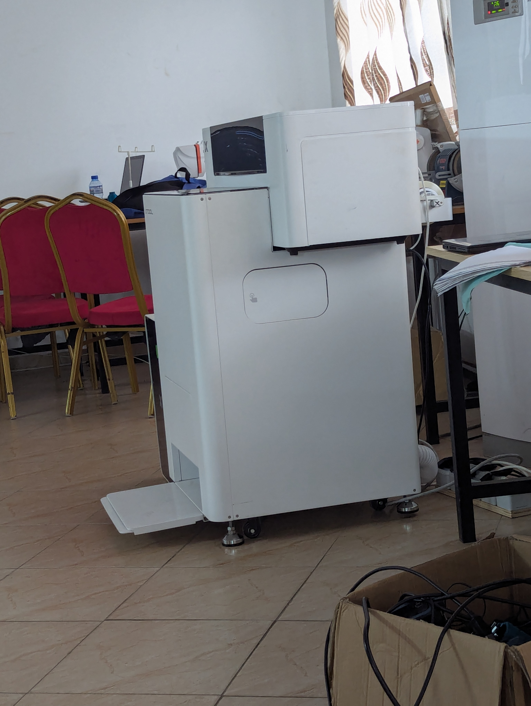
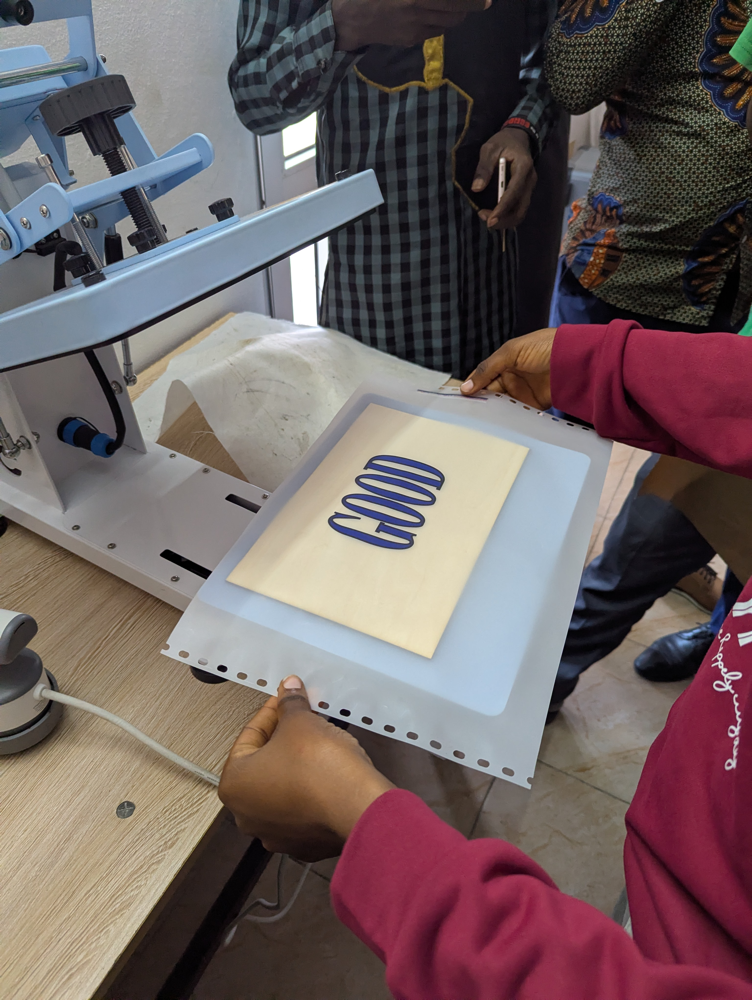
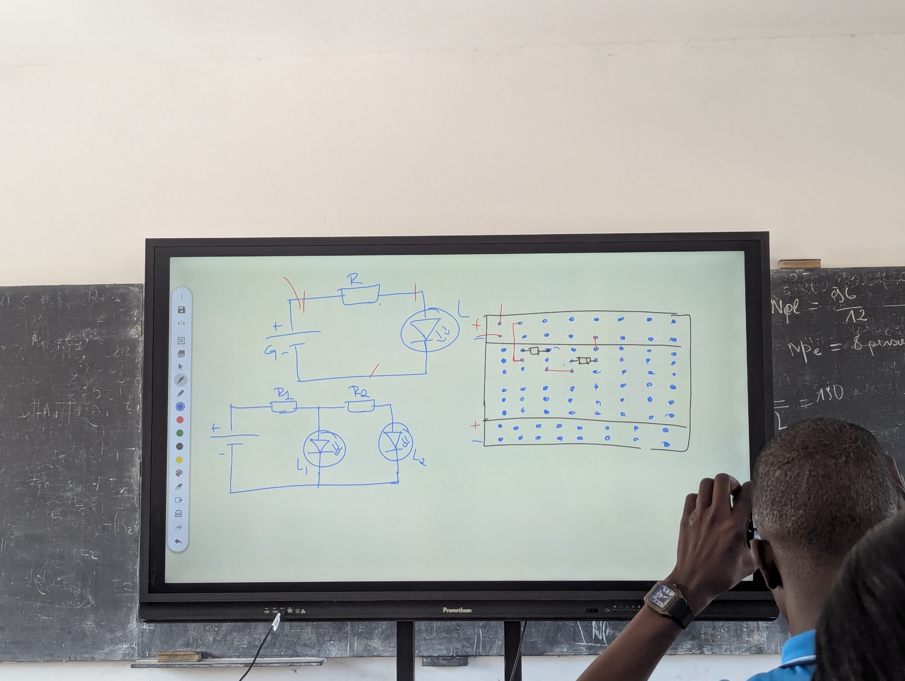
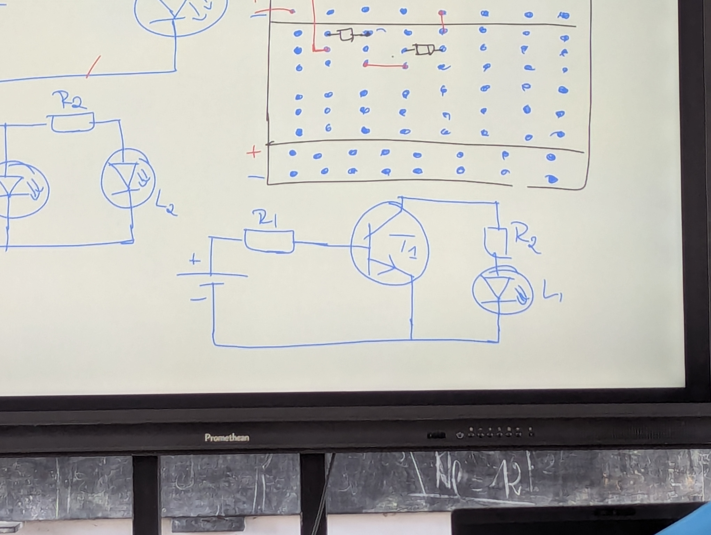
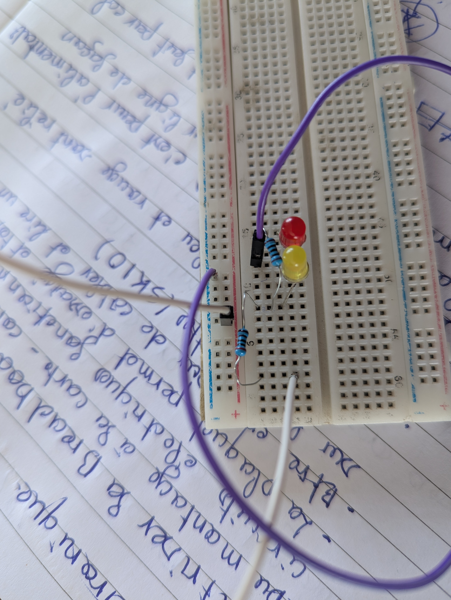
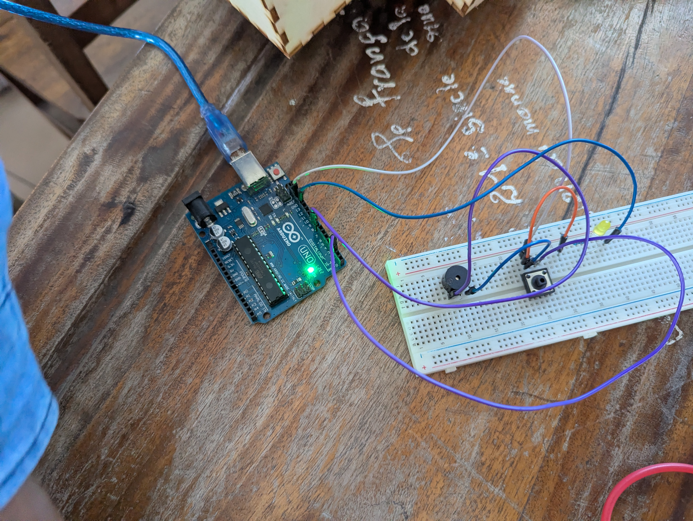
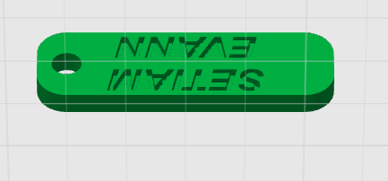

> # Journal — Mardi 01 septembre 2026 (rédigé par : Afi Awinam AKPOSSA)

>

## Fait aujourd'hui

- impression DTF avec Xtool
- maitriser la Breadboard SK10 (du montage a la carte-construire les premier circuits electrique fonctionnel) 

## Appris 
### atelier de decoupe laser
- comment imprimer une moti ou une photo sur du testile en utilisant l'impression DTF avec XTOOL
- les etapes du DTF ( concevoir: le moti est crée ou importé dans le logiciel, imprimer: le motif est imprimé sur le film DTF EN ENCRE COULEUR, poudrer: la poudre adhesive thermofusible est appliquée sur l'encre encore humide)
- les materiel necessaire( l'imprimante DTF Xtool, film DTF, Encre DTF ( C, M, J, N+Blanc), poudre adhésion thermofusible, Four/ poudre cuisson, presse a chaud, vétement a personnaliser)
- les avantage (moti multicolores et detaillé, petites séries et piéces unique, compatible avec de nombreux textiles, pas d'ecran à fabriquer
- sécurité et qualité( respecte les parametres recommandé par xtool, garde la wone de travail propre et ventillé, utilisé les equipements de protection recommandé pour la manipulation des commandes( poudre, encreb)))
- 
- 
-

### atelier electronique 
- maitriser la Bread boardSK10
- construction sur la plaquette
- 
- 
- 
- 

### CONCEPTION AVEC FUSION
- pour toute conception on commence toujours par esquise
- 
- réalisation d'une porte clé
- 
## Raté, puis corrigé

- 

