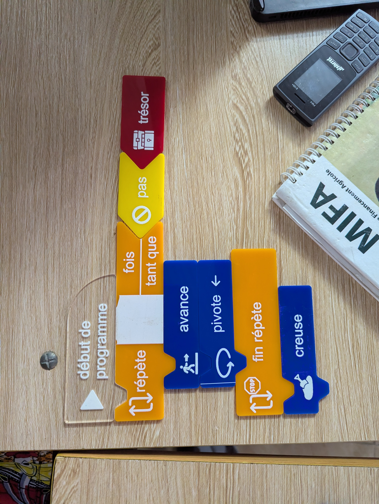
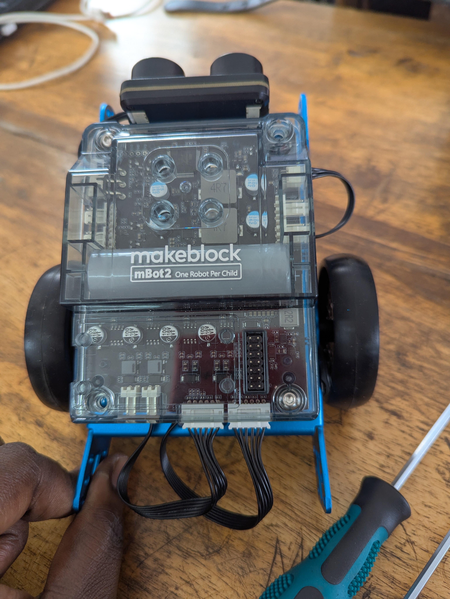
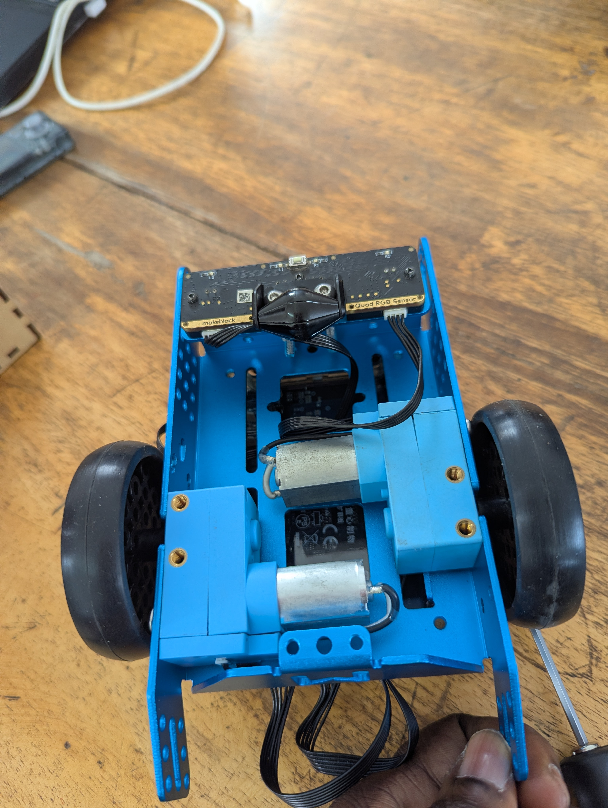
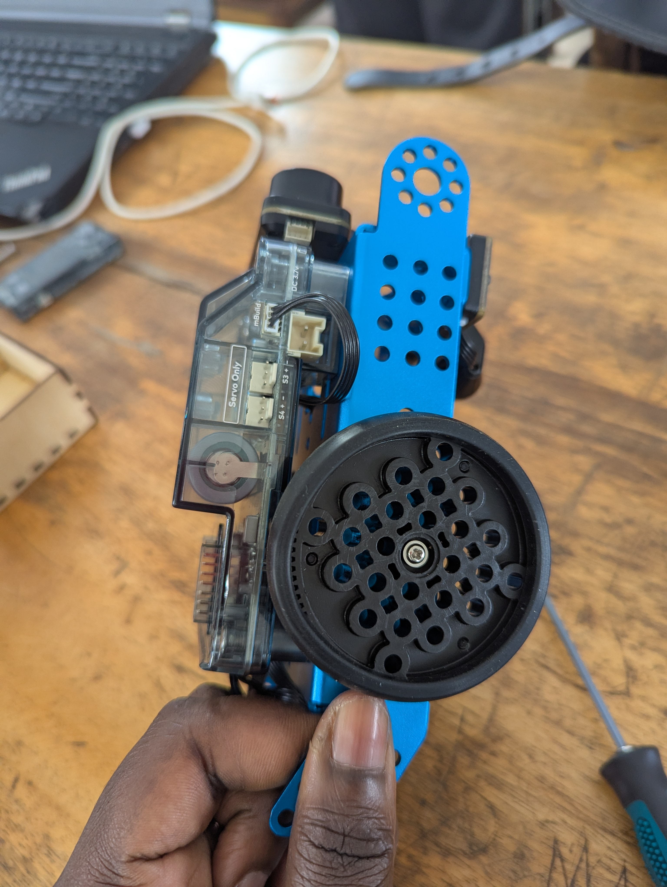

# Journal — Mercredi 02 septembre 2026 (rédigé par : Afi Awinam AKPOSSA)

## Fait aujourd'hui
- Fondamentaux pour les utures fabmanager( un algorithme, les modes opératoire, l'objectif, les critéres,)
- montage du robot Rbote 2

## Appris 
### atelier de decoupe laser 
- un algoritheme : c'est une suite d'instruction logique et ordonnée non embigue permetant d'accomplire une tâche spécifique pour resoudre un problème
- un algoritheme debranchée : c'est le fait de faire de l'algorithme sans utilisé la machine ( pensé comme un ordinateur)
- l'objectif : comprendre la logique avant d'écrire une line de code
- 3 critéres d'un bon algorithme : une suite ordonné d'instructions, un nombre ini d'etape, des instructions précise qui résolvent un probléme données
- 

### atelier électronique
- montage d'un robot Rbot 2
- 
- 
- 
- programation et fonctionnement du robot
- <video controls src="PXL_20260902_122534045.TS.mp4" title="Title"></video>

### Travail en groupe 

## Raté, puis corrigé

-