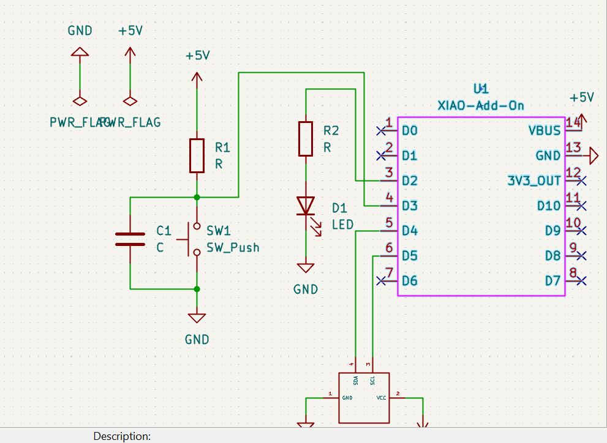
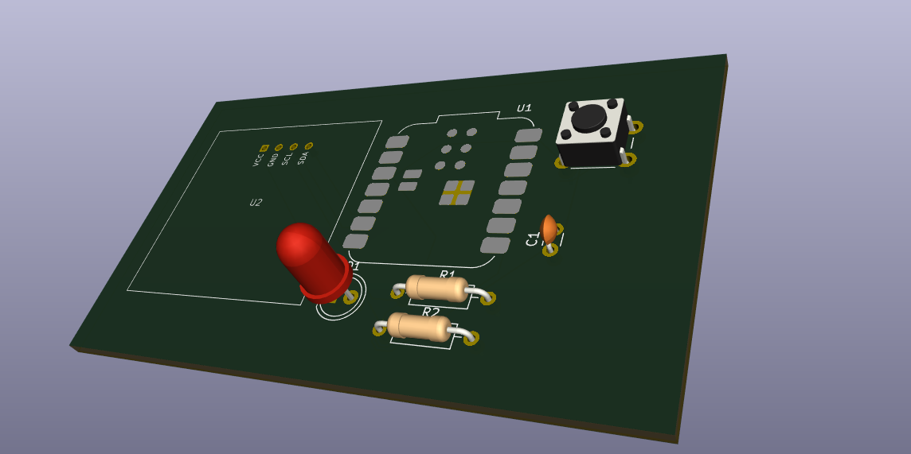
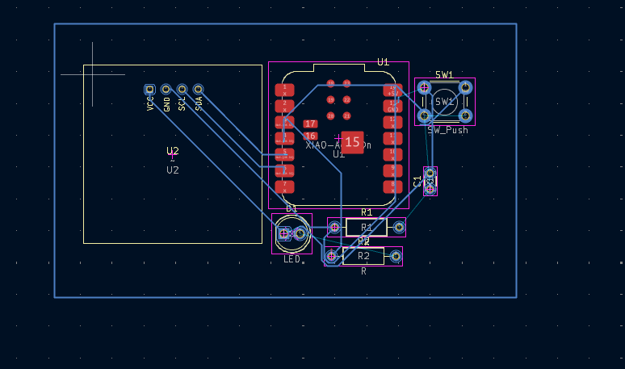

# Journal — mardi 09 septembre 2026 (rédigé par :AKPOSSA Afi Awinam)

## Fait aujourd'hui

- Instalation d'une librairie dans Kicard
- Dessiner un symbole qui n'est pas dans Kicard et l'utiliser( xiao ESP32-C)
- Assignés des emprunts
- La programmation

## Appri 
### Comment installé une librairie dans Kicard
- Préference + configurer les librairies + icone de dossier + dossier librerry
- Preference + gérer les librairie de Blocs de conception + icone de dossier + steep xiao.pretty

### comment dessiner des symboles qui ne sont pa dans Kicard
- Editeur de symbole + fichier + nouvelle librairie + oled + clic droit
- Appés le carré 128/128 ON fait alt 3 + sortir + clic droit + créer une zone a partir de la selection
- AVERTISSEMENT ( 2 clic + Emprunte + 2clic sur les 3barres + filtre(xiao))
- Assigné les emprunts
- 
- 
- 
### programmation
- L'essentiel a connaitre ( les variables, structure conditionnel, fonction, les commentaires, les boucles, les opérateurs )
- l'informatique c'est la contraction de deux mots (information + automatique)
- Programme du prjet Oled 